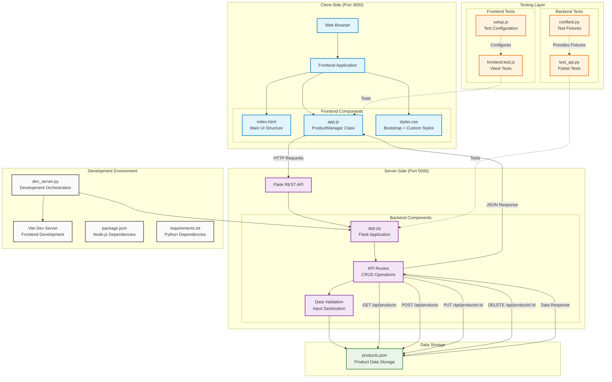
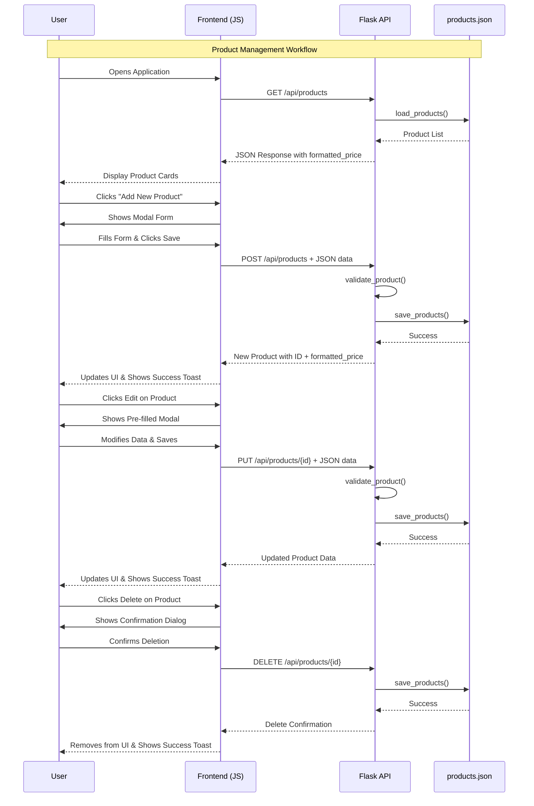
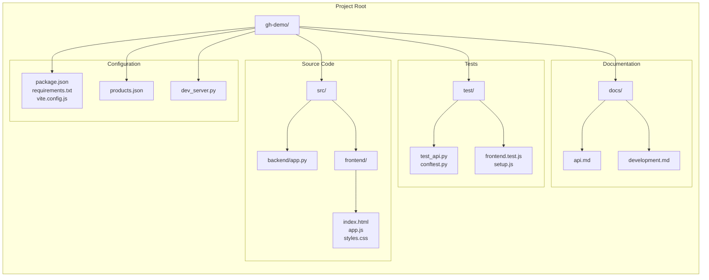

# Project Architecture Diagram

This diagram represents the overall architecture and data flow of the Insurance Products application, which is a full-stack web application for managing insurance products with a Flask backend API and JavaScript frontend.

## System Overview

The application follows a typical client-server architecture with the following main components:

- **Frontend**: JavaScript-based SPA using Bootstrap for UI
- **Backend**: Flask REST API server
- **Data Storage**: JSON file-based storage
- **Testing**: Comprehensive test suites for both frontend and backend

## Architecture Diagram

## API Data Flow Diagram

## File Structure Overview

## Technology Stack

- **Frontend**:
  - JavaScript ES2022 with ESM modules
  - Bootstrap 5.3.2 for responsive UI
  - Vite for development server and build tooling
  - Vitest for testing with JSDOM environment

- **Backend**:
  - Python 3.11+ with Flask framework
  - Flask-CORS for cross-origin request handling
  - JSON file-based data persistence
  - Pytest for comprehensive API testing

- **Development Tools**:
  - Custom development server orchestration script
  - Comprehensive test coverage for both layers
  - Modular project structure following best practices

## Key Features Illustrated

1. **CRUD Operations**: Complete Create, Read, Update, Delete functionality for insurance products
2. **Real-time UI Updates**: Frontend immediately reflects backend changes
3. **Input Validation**: Both client-side and server-side validation
4. **Currency Formatting**: Consistent USD formatting with two decimal places
5. **Error Handling**: Comprehensive error handling with user-friendly messages
6. **Responsive Design**: Bootstrap-based responsive UI components
7. **Testing Coverage**: Unit tests for both frontend and backend components
